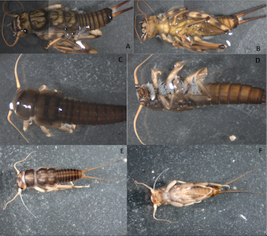
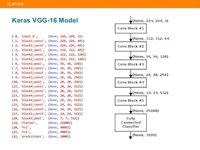
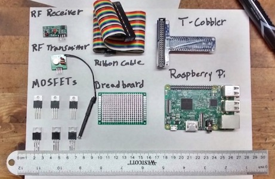
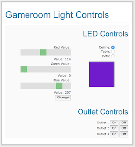

# Timothy Salazar
linkedIn: https://www.linkedin.com/in/timothy-salazar/

email: timothy.salazar@colorado.edu

## About Me

I'm a recent graduate from the Galvanize Data Science Immersive. This intensive three month program covers the statistical methods, python tools, and machine learning algorithms that make up a data scientist's toolkit. During the program we tackled three case studies using real-world data, including churn prediction for a ride-share company, fraud detection, and predicting the price of farm equipment at auction. For our capstone project we each chose a problem where we could apply these data science tools. 

My undergraduate degree was Geography with a minor in Ecology and Evolutionary Biology from the University of Colorado, Boulder. I focused on hydrology, earning the undergraduate Hydrology and Water Resources certificate. I became interested in data science because of the huge amount of data produced by instruments in the field - precipitation, streamflow, and wind gauges along with lysimeters, LIDAR imagery, and lab results from samples in the field. All of these need to be integrated into a coherent picture of what's going on in the field. As I prepared for graduate school, I taught myself Python and data science methods from some excellent courses availble on Coursera. Before long I was interested enough to change directions entirely, and to pursue data science full time. 

## Projects
### [Water Bugs](https://github.com/timothy-salazar/water-bugs "Water Bugs Repository")

This is my capstone project. I wanted to build a model that could identify benthic macroinvertebrates, which are stream insects that are commonly used to gauge water quality. I scraped 9000 images of benthic macroinvertebrates from the web, processed them using Numpy and Scikit-Image, and then used them to train a Convolutional Neural Network (CNN). I built the network with the Keras deep learning library, and used existing weights from the VGG-16 model for feature extraction. The network was trained on an AWS instance, and it was able to achieve 90% accuracy, precision, and recall between orders.
### [Light Controls with a Raspberry Pi](https://github.com/timothy-salazar/light_controls "Light Controls Repository")

This is an older project which I started in early 2017, a few months before I enrolled the Galvanize Data Science Immersive. I recently had time to finish it, and I'm fairly proud of the final results. It allows the user to control RGB LED strips through a Flask web application hosted on a local network. 
